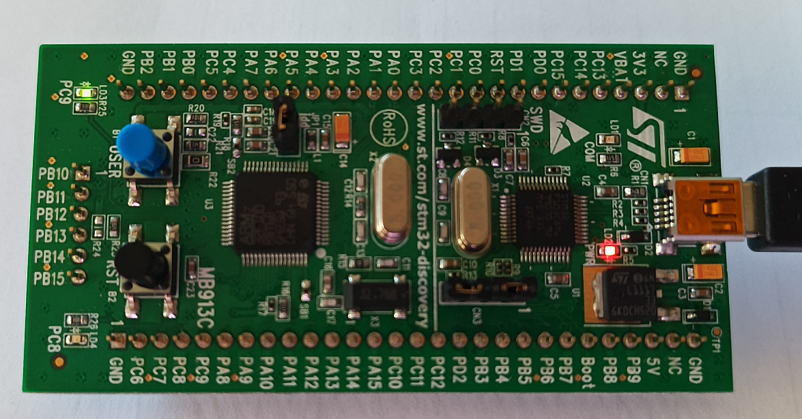

Assumes libopencm3 (https://github.com/libopencm3/libopencm3) is installed (``git clone https://github.com/libopencm3/libopencm3 && cd libopencm3 && make``): make sure to adapt
-L and -I options to your directory structure so that libraries and header files are found at compile time.

For STM32F1(00)-VL-Discovery board, 
```shell
ln -s Makefile.stm32f1 Makefile
make
```

For STM32F4 based boards,
```shell
ln -s Makefile.stm32f4 Makefile
make
```

For STM32F1(03) based boards,
```shell
ln -s Makefile.stm32f1 Makefile
make
```

For running on qemu, Andre Beckus' version of qemu for STM32 as found at
https://github.com/beckus/qemu_stm32 is no longer usable (relying on Python2) and
```shell
make -f Makefile.stm32f1 qemu
```
will no longer run. See https://gist.github.com/franzflasch/6c52f28eb1327213d5e83e299bd775eb for alternative version of QEMU supporting the STM32F1.

The software architecture is organized to provide functions with the same prototype (input
and output arguments) for various microcontroller architectures and select upon linking
which version is used with portable, common main functions. Start with ``main_uart.c`` as
a basic example, and link the appropriate ``Makefile.*`` to ``Makefile`` (ln -s) to compile
for the given target using ``make``.

# Getting familiar with GDB (STM32F100VL-Discovery/QEMU)

## STM32VLD-Discovery



Terminal1: ``st-util`` returns ``INFO common.c: STM32F1xx_VL_MD_LD: 8 KiB SRAM, 128 KiB flash in at least 1 KiB pages``
and ``INFO gdb-server.c: Listening at *:4242...``

Terminal2: run ``gdb-multiarch -q test.elf`` and from the GDB terminal:
```
target remote localhost:4242
load
break fact
continue
```
will output after a few seconds
```
Breakpoint 1, fact (n=5) at factoriel.c:7
7       {volatile int __attribute__((unused)) tmp=n;
```
and dumping the stack with ``bt`` shows
```
#0  fact (n=5) at factoriel.c:7
#1  0x0800019a in main () at factoriel.c:22
```
Then ``continue`` and once stopped, ``bt`` will show
```
(gdb) continue
Continuing.
 
Breakpoint 1, fact (n=4) at factoriel.c:7
7       {volatile int __attribute__((unused)) tmp=n;
(gdb) bt
#0  fact (n=4) at factoriel.c:7
#1  0x0800016c in fact (n=5) at factoriel.c:9
#2  0x0800019a in main () at factoriel.c:22
```
We can dump the content of the heap with ``x/10x 0x20000000``
showing
```
0x20000000 <variable2.1>:       0x00000055      0x00000042      0x016e3600      0x016e3600
0x20000010 <rcc_apb2_frequency>:        0x016e3600      0x0701f04f      0x423c682c      0xf04fd1fc
0x20000020:     0x423c0714      0x3a02d101
```
and the content of the stack with ``x/10x $sp`` showing
```
0x20001fb0:     0x20001fc1      0x00000004      0x20001fc0      0x00000004
0x20001fc0:     0x20001fc8      0x0800016d      0xddee7e76      0x00000005
0x20001fd0:     0x20001fc1      0x00000005
```
while the position of the stack is given with ``print $sp`` and showing ``$1 = (void *) 0x20001fb0``
or anything close to the end of the RAM region depending on past function call history.

``step`` v.s. ``next``:  when calling a function, ``next`` executes the functions and returns to
the function output, while ``step`` will go into the function and continue step by step execution.

## QEMU

Launch ``qemu`` emulating the STM32VL-Discovery with 
```
qemu-system-arm -M stm32vldiscovery -s -S -serial stdio -kernel test.bin
```
with ``-s`` telling to launch the GDB server on port 1234 and ``-S`` to *not* run the program
until requested to. Then same as before, except ``target remote localhost:1234``

Notice that when linking with ``libopencm3``, if nothing happens and CTRL-c to break will display
```
Program received signal SIGINT, Interrupt.
0x080006b2 in rcc_is_osc_ready (osc=<optimized out>) at rcc.c:353
353                     return RCC_CR & RCC_CR_HSERDY;
```
indicating the executing is hanging in the PLL test function. This peripheral is erroneously
emulated with qemu and the function must be commented out in libopencm3, by editing ``libopencm3/lib/stm32/f1/rcc.c`` and commenting ``while (!rcc_is_osc_ready(osc));`` in ``rcc_wait_for_osc_ready(enum rcc_osc osc)``. After the modification, recompile ``libopencm3`` and this program to link with the
updated library. If all goes well:
```
$ gdb-multiarch -q test.elf 
Reading symbols from test.elf...
(gdb) target remote localhost:1234
Remote debugging using localhost:1234
reset_handler () at ../../cm3/vector.c:67
67              for (src = &_data_loadaddr, dest = &_data;
(gdb) load
Loading section .text, size 0x1284 lma 0x8000000
Loading section .data, size 0x14 lma 0x8001284
Start address 0x080010bc, load size 4760
Transfer rate: 4648 KB/sec, 1190 bytes/write.
(gdb) break fact
Breakpoint 1 at 0x8000158: file factoriel.c, line 7.
(gdb) continue
Continuing.
 
Breakpoint 1, fact (n=5) at factoriel.c:7
7       {volatile int __attribute__((unused)) tmp=n;
(gdb) 
```
